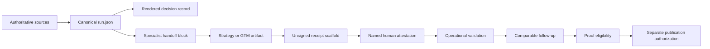
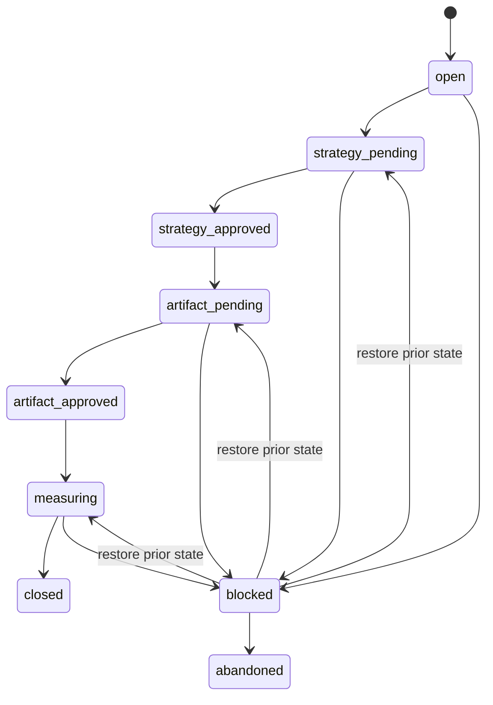
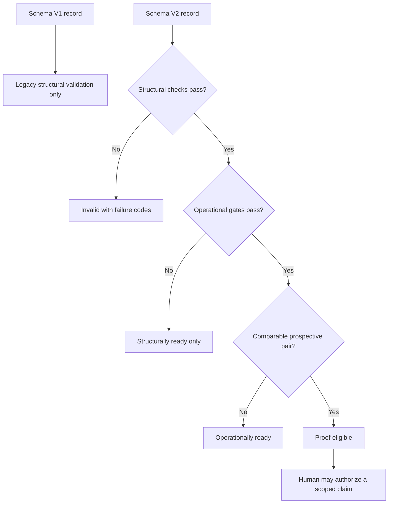

# Goal Capsule

Ship Compound Marketing V1 as a governed, resumable strategy-to-GTM system that a fresh operator can run from a blank project, hand to the right Marketing OS specialist, validate for internally consistent evidence, and reuse without reconstructing the strategy.

---

# Product Contract

## Summary

Compound Marketing turns scattered company context into one governed decision record, routes it through strategy and GTM work, and preserves accepted decisions for the next comparable run. V1 covers strategy, program briefs, GTM planning, measurement, and learning. Design, asset production, and channel automation stay out.

## Problem Frame

The current branch explains the system but cannot yet operate it safely. A new run has no canonical initializer, a fresh agent cannot deterministically find the right unfinished run, governing decisions exist in parallel human and machine records, specialist templates can drop handoff metadata, and the validator can accept self-reported state that does not prove the reviewed artifact or decision version.

## Key Decisions

1. **Core V1 scope.** Build the strategy, program, GTM, evaluation, and learning system only. Design, asset production, and channel automation are deferred. *(session-settled: user-approved — chosen over expanding into execution surfaces because the immediate goal is a rigorous core marketing system.)* Governs R1, R9, R18.
2. **One governed workspace.** Every run uses one project-local shared directory and one canonical machine record that downstream specialists inherit. *(session-settled: user-approved — chosen over reconstructing context at each stage because decisions must survive handoffs.)* Governs R2-R8, R12-R15.
3. **Proof means prospective reuse.** A compounding claim requires two comparable prospective operational runs, predeclared measures, accepted inherited decisions, and a different named follow-up operator. Retrospective fixtures and synthetic rehearsals test structure only. *(session-settled: user-approved — chosen over retrospective or synthetic proof because the claim must describe observed reuse.)* Governs R16-R17.
4. **LFG ships the fix.** This plan is implemented, verified, reviewed, pushed, and watched without another approval pause. *(session-settled: user-directed — chosen over another recommendation pass because the user explicitly asked to fix and ship the system.)*

## Requirements

### Canonical governance

- **R1.** Schema V2 models workflow family, routed output, operator, lifecycle, stages, sources, decisions, protected language, questions, metrics, approvals, evidence origin, and proof state.
- **R2.** `run.json` is canonical state. Human-readable Markdown is a projection, not an independently editable source of truth.
- **R3.** Every decision, source, protected phrase, question, and approval has a stable ID or immutable reference that handoffs can resolve.
- **R4.** Blocking source conflicts or questions affecting audience, offer, proof, primary action, canonical language, or approval prevent strategy approval.
- **R5.** Strategic approval is bound to the exact decision-record digest. Artifact acceptance, fidelity attestation, and publication authorization are separate human rulings additionally bound to the reviewed artifact revision or digest. The checker validates record consistency; it cannot authenticate the human or establish the truth of an attestation.

### Lifecycle and recovery

- **R6.** A supported initializer creates an honest unsigned run atomically and never overwrites existing files.
- **R7.** Discovery returns the one unfinished run matching normalized project and workflow, returns none when absent, and fails with paths when multiple runs match.
- **R8.** Legal transitions are `open -> strategy_pending -> strategy_approved -> artifact_pending -> artifact_approved -> measuring -> closed`, with explicit `blocked` and `abandoned` branches. A blocked run stores and restores its prior state. `closed` and `abandoned` are terminal; corrections or further work create a linked successor run. Artifacts and receipts remain null until they exist; `not_applicable` requires a reason.

### Specialist handoffs

- **R9.** One conditional handoff block is structurally identical across `marketing/gtm`, `strategy/program-brief`, `launches/gtm-plan`, and `strategy/one-pager`.
- **R10.** It carries run ID, decision-record version and digest, inherited decision IDs, protected-language IDs, unresolved-question IDs, artifact owner, and exact record paths.
- **R11.** Customer-facing output may omit governance metadata only when the same block remains in the governed source or companion handoff file.
- **R12.** Governing records are single-writer; optional workers return proposed changes and may not overwrite canonical state.
- **R12a.** One run governs one routed output. Related strategy and GTM outputs use linked successor runs so each artifact has an unambiguous owner, receipt, lifecycle, measurement window, and comparison history.

### Validation and proof

- **R13.** Structural readiness validates schema and resolvable governance. Operational readiness additionally requires legal completion, current digests, and signed human receipts for applicable stages.
- **R14.** Readiness is monotonic: operational implies structural; comparison eligibility implies operational. Machine failure codes accompany plain-language errors; exit codes remain 0 success, 1 invalid or ineligible, and 2 unreadable or malformed input.
- **R15.** Local artifacts are bound by SHA-256. Remote artifacts require an immutable revision ID or a locally exported snapshot whose bytes are hashed. A human version label without content binding is structural evidence only and cannot establish operational readiness.
- **R16.** Comparison uses canonical workflow families plus predeclared artifact class, scope, primary audience, and measurement method, and requires a named human comparability rationale.
- **R17.** Proof eligibility is computed from two prospective operational runs with predeclared measures. The follow-up must accept named inherited decision IDs and name a different operator from the baseline. This is eligibility under recorded attestations, not cryptographic proof of human identity. Publication authorization is separate and human-only; the checker never creates it.

### Compatibility and boundaries

- **R18.** Schema V1 remains valid as legacy structural evidence but can never become operationally ready or proof eligible. New runs use V2; missing historical evidence is never backfilled.
- **R19.** A neutral filesystem rehearsal proves initialization, handoff scaffolding, receipt scaffolding, interruption recovery, and validation. It is synthetic and cannot support a compounding claim.

## Success Criteria

- A fresh agent in a temporary project can initialize or resume a run using the tool's absolute path and no repository-root assumptions.
- The validator rejects missing sources, unresolved blockers, illegal transitions, unsigned human gates, changed decision or artifact revisions, path escapes, and malformed nested values without crashing.
- Each routed specialist receives the same governed handoff contract.
- Legacy fixtures remain honest structural baselines, while V2 synthetic fixtures cannot be mistaken for prospective proof.
- The repository test suite passes and the PR makes no premature compounding claim.
- A representative brief selects one route, produces one artifact, and receives a named human quality ruling against the applicable existing specialist rubric; this regression evidence remains separate from compounding proof.

## Scope Boundaries

### In scope

- File-based run lifecycle and discovery
- Canonical governance schema and human-readable projection
- Four specialist handoffs
- Structural, operational, comparison, and proof gates
- Synthetic end-to-end regression coverage

### Deferred for later

- Design systems, asset production, channel execution, and channel automation
- A UI, hosted service, MCP server, or workflow API
- Convenience integrations beyond the file-based CLI
- A durable Compound Marketing solution write-up, until prospective evidence exists

### Human-only

- Source authorization and strategic rulings
- Approval of externally visible artifacts
- Fidelity attestation and publication authorization

---

# Planning Contract

## Key Technical Decisions

1. **KTD1: Canonical JSON with Markdown projection.** `run.json` owns state; the tool renders `run.md` and `decision-record.md`, then binds the projection with SHA-256. *(session-settled: user-approved — instantiates R2 and R5; chosen over parallel editable records because digests cannot reconcile two independent sources of truth.)*
2. **KTD2: Filesystem lifecycle CLI.** Extend the checker with `init`, `discover`, `handoff`, `receipt`, `render`, `transition`, `validate`, and `compare`, keeping the shared run directory as the public interface. *(session-settled: user-approved — instantiates R6-R8 and R19; chosen over a service layer because V1 must work in any agent workspace.)*
3. **KTD3: Human gates start unsigned.** Commands may scaffold approval objects but cannot fill approver, approval time, reviewed revision, or claim authorization. *(session-settled: user-approved — instantiates R5 and R17; chosen over trusted Boolean fields because the producing agent cannot attest to its own fidelity.)*
4. **KTD4: One reusable handoff contract.** All four specialist routes reference the same handoff specification and conditional placement rule. *(session-settled: user-approved — instantiates R9-R11; chosen over route-specific prose because route drift is the failure being fixed.)*
5. **KTD5: Schema V2 with legacy V1 containment.** V2 powers new runs; V1 validates only as legacy structural evidence. *(session-settled: user-approved — instantiates R18; chosen over rewriting old fixtures because missing historical evidence must remain missing.)*

## High-Level Technical Design

These sketches show responsibility and sequence, not exact implementation syntax.





## V2 Record Contract

The normative V2 starter fixture and validator own the exact shape. The top-level record contains:

- Identity: `schema_version`, `run_id`, normalized `project_key`, display `project`, `workflow_family`, `routed_output`, `operator`, `created_at`, and `updated_at`.
- Lifecycle: `lifecycle.status`, `lifecycle.prior_status`, `current_stage`, `next_action`, `blocked_on`, and terminal `closed_at` or `abandoned_at`.
- Governance collections: `sources`, `source_conflicts`, `decisions`, `protected_language`, and `questions`, each with stable IDs, ownership, authority, status, and state-dependent fields.
- One artifact record: requested class and scope, audience, owner, local path or remote immutable revision/export digest, receipt, and stage status.
- Measures: definition, unit, method, declared-by, declared-at, work-started-at, observed-at, value, window, and decision date.
- Human rulings: strategy approval, artifact acceptance, fidelity attestation, comparability approval, and publication authorization. Every ruling starts unsigned and records applicability, approver, timestamp, governed digest, artifact binding when applicable, and a reason when not applicable.
- Proof metadata: evidence timing, evidence origin, predecessor/comparison run, inherited decision IDs, comparability dimensions and rationale, and approved claim scope. Eligibility is derived, never stored as authority.

Closed records are rendered and snapshotted by digest. No command mutates a terminal run. A successor names the terminal run it follows.

## CLI Contract

All commands emit one JSON object and accept absolute or project-relative paths without requiring the Marketing OS repository as the current directory.

- `init PROJECT_ROOT --project NAME --workflow FAMILY --route ROUTE --operator ID [--force-new]` creates one V2 run atomically or returns the single matching unfinished run. `--force-new` requires a distinct run ID and never overwrites a match.
- `discover PROJECT_ROOT --project NAME --workflow FAMILY` returns zero or one unfinished match; multiple matches exit 1 and list their paths.
- `render RUN_JSON` regenerates the human run and decision projections and records their digests.
- `handoff RUN_JSON --owner ID` scaffolds and validates the machine-readable handoff sidecar for the selected route.
- `receipt RUN_JSON --stage STAGE --artifact REF` scaffolds an unsigned receipt; a human supplies approval fields outside the command.
- `transition RUN_JSON STATUS [--reason TEXT]` validates the transition, preserves `prior_status` for blocked runs, updates timestamps, and refuses terminal mutation or missing prerequisites.
- `validate RUN_JSON` reports legacy, structural, operational, and comparison readiness with stable failure codes.
- `compare BASELINE_JSON FOLLOWUP_JSON` reports comparison failures and recorded-evidence proof eligibility, never publication authorization.

Exit 0 means the operation or validation succeeded, exit 1 means a readable record was invalid or ineligible, and exit 2 means input was unreadable or malformed. Mutation commands use exclusive creation and atomic replace inside the run directory.

## Route and Approval Contract

Each run chooses exactly one route:

| Route | Use when | Output | Next handoff |
|---|---|---|---|
| `program_brief` | A recurring marketing program needs an operating brief and decision gate | Program brief | Owner approval, then a linked GTM run if needed |
| `one_pager` | Approved strategy must become a concise internal or external strategy surface | One-pager | Named artifact owner or linked GTM run |
| `marketing_gtm` | A complex launch needs one integrated master plan and social brief | GTM master plan | Launch owners and production |
| `gtm_plan` | A bounded launch needs audience, journey, sequence, measurement, and operating detail | Execution-ready GTM plan | Launch owners and channel work outside V1 |

Strategy approval is required before routed work. Artifact acceptance and fidelity attestation are required for operational readiness. Publication authorization applies only to an external compounding claim. Internal drafts may mark artifact acceptance or fidelity not applicable only with a named human reason; doing so prevents operational and proof eligibility.



## Assumptions

- Python's standard library is sufficient.
- Stable operator identities are nonempty strings, not identity-provider integrations.
- Remote artifacts use an immutable revision ID or explicit human-reviewed version label.
- Closed runs are immutable; later corrections create linked successors.

## Risks and Controls

- **False proof:** Separate synthetic and retrospective origin from prospective timing; require two operational records and compute operator independence.
- **Split-brain state:** Generate Markdown from canonical JSON and verify its digest before accepted handoffs.
- **Agent self-approval:** Scaffold blank attestations and state that validation checks consistency rather than human identity or truthfulness.
- **Duplicate runs:** Use normalized matching, exclusive creation, explicit abandonment, and multiple-match failure.
- **Parallel writes:** Make the orchestrator the single writer; pods produce proposals in separate files.
- **Path escape:** Resolve every shared path beneath its run directory and reject traversal or symlink escape.

---

# Implementation Units

## U1: Define and initialize the V2 governed run

**Requirements:** R1-R8, R18; KTD1-KTD3, KTD5.

**Files:** `strategy/compound-marketing/scripts/check_run.py`, the run, decision, and receipt references, and `strategy/compound-marketing/tests/test_check_run.py`.

**Approach:** Add V2 schema constants, lifecycle rules, canonical JSON starter, atomic initializer, deterministic discovery, rendering, and transition helpers. Keep V1 parsing intact but downgrade it to legacy structural status.

**Test scenarios:**

- Initialize a blank project and assert one V2 run directory, canonical JSON, and rendered projections are created with unsigned approvals and null artifacts.
- Repeat initialization and assert the existing run is returned without overwrite; multiple matches fail with paths.
- Recover from a partial directory and reject traversal or symlink escape without modifying outside files.
- Exercise legal transitions, block and restore the prior state, abandon, and create a linked successor; reject skipped gates and terminal mutation.

## U2: Make validation inspect governed evidence

**Requirements:** R3-R5, R13-R18; KTD1, KTD3, KTD5.

**Files:** the checker, proof standard, fixtures, and checker tests.

**Approach:** Validate authority, blockers, protected language, questions, projection digests, receipts, artifact revisions, metric timing, evidence origin, workflow dimensions, operators, and publication authorization. Return monotonic readiness and stable failure codes.

**Test scenarios:**

- Validate an unfinished V2 run for structural readiness only, then sign exact receipts and complete legal stages for operational readiness.
- Change a projection, artifact, remote revision, verifier, or receipt after approval and assert the matching failure code.
- Supply malformed nested objects, null decisions, duplicates, late metrics, blockers, or unsigned gates and assert JSON output without a crash.
- Compare qualifying prospective operational records, mutate each proof gate, and assert exact ineligibility reasons.
- Validate V1 fixtures as legacy structural evidence with operational and proof readiness false.

## U3: Standardize every specialist handoff

**Requirements:** R9-R12; KTD4.

**Files:** new `strategy/compound-marketing/references/handoff-contract.md`; the four routed skills, their templates, and relevant evals.

**Approach:** Define one conditional machine-readable sidecar plus a human-readable block. Make every route consume it, preserve governed IDs, and keep it out of published output only through a named companion source. Add the route-selection table and keep each run to one routed output.

**Test scenarios:**

- Route one governed packet through each specialist in separate fixture runs and preserve identical contract fields, IDs, paths, owner, and questions.
- Omit or alter a locked ID or protected phrase and assert evaluator failure.
- Publish a one-pager without embedded metadata while retaining a valid companion handoff.

## U4: Exercise the agent-operated filesystem flow

**Requirements:** R6-R8, R12-R15, R19; KTD2-KTD3.

**Files:** checker tests, eval cases, and synthetic fixtures only when generation is insufficient.

**Approach:** Add a subprocess rehearsal outside the repository: initialize, discover, render a handoff, scaffold a receipt, simulate human completion, interrupt and resume, transition, validate, and compare ineligible synthetic records.

**Test scenarios:**

- Complete the happy path and assert documented JSON responses and exit codes 0, 1, and 2.
- Fail closed on multiple unfinished matches, stale digest, unsigned receipt, illegal transition, and path escape; restore a blocked run to its recorded prior state.
- Prevent synthetic evidence from becoming proof eligible even after operational gates pass.

## U5: Align the public system contract and routing

**Requirements:** R1-R19.

**Files:** Compound Marketing skill and references, golden path, `CONCEPTS.md`, `STRATEGY.md`, `README.md`, and `skill-map.md`.

**Approach:** Document blank-project entry, resume, lifecycle, route selection, single-writer boundary, approval applicability, human-only gates, readiness, legacy policy, routed outputs, and honest proof threshold. Remove wording implying retrospective or synthetic evidence demonstrates compounding.

**Test scenarios:**

- Follow only the skill and references from a blank project and reach the same validated state as the rehearsal.
- Route one representative brief and record a named human quality ruling against the selected specialist's existing rubric without treating that rehearsal as compounding proof.
- Search for conflicting workflow labels, self-approval, publication/proof conflation, repository-root-only commands, and premature compounding claims.

## U6: Final regression and release evidence

**Requirements:** R1-R19.

**Files:** all files changed by this plan.

**Approach:** Run the full test suite, compile Python, parse JSON/YAML, inspect the diff for caches or unrelated work, and verify the PR describes the evidence boundary accurately.

**Test expectation:** None beyond the repository-wide verification contract; this is a release gate, not a feature-bearing unit.

---

# Verification Contract

```bash
python3 -m unittest foundation/marketing-os/tests/test_check_learning_loop.py strategy/compound-marketing/tests/test_check_run.py
python3 -m py_compile strategy/compound-marketing/scripts/check_run.py foundation/marketing-os/scripts/check_learning_loop.py
python3 -m json.tool strategy/compound-marketing/evals/cases.json >/dev/null
python3 strategy/compound-marketing/scripts/check_run.py --help
git diff --check
```

Checker tests include direct-function and subprocess coverage. Failure paths return structured output, never a traceback. Final review excludes caches, active project data, invented retrospective evidence, and unrelated changes.

---

# Definition of Done

- New operators can initialize, discover, resume, hand off, validate, and close a governed run from outside the repository.
- Canonical JSON, rendered records, receipts, attestations, and comparison evidence cannot drift silently.
- The four routed specialists share one inherited-decision contract.
- V1 stays legacy structural evidence; V2 synthetic rehearsals cannot qualify as compounding proof.
- Tests cover lifecycle, malformed records, human gates, digest tampering, duplicate discovery, and proof-gate mutations.
- Documentation, concepts, routing, and CLI behavior agree.
- Repository verification passes, eligible review findings are fixed and committed, the branch is pushed, and PR #21 is CI-decided with no unresolved critical review issue.
